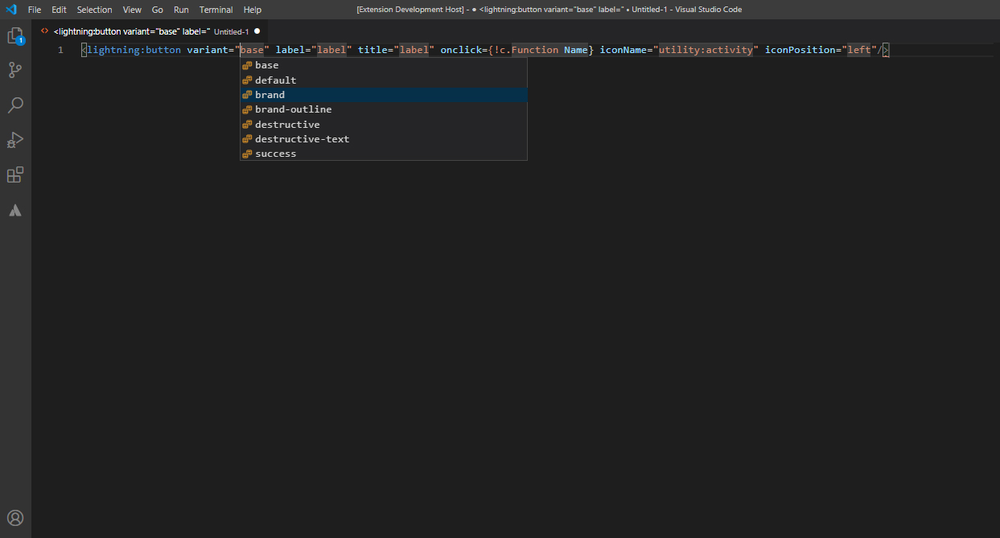

# Audibene Code Snippets

A set of HTML, JS and Apex Snippets for Visual Studio Code.
Create a new HTML document and type 'adbn:' to see all available snippets.

## Available Snippets

### HTML
Trigger | Description
--- | ---
adbn-grid | Default Grid
adbn-grid:gutters | Grid Gutters
adbn-grid:wrap | Grid Wrap
adbn-grid:vertical | Grid Vertical
adbn-grid:centered | Grid centered
adbn-grid:spaced | Grid evenly spaced
adbn-grid:spread | Grid evenly spread
adbn-grid:right | Grid Right
adbn-grid:vertical_top | Vertical Top
adbn-grid:vertical_center | Vertical Center
adbn-grid:vertical_bottom | Vertical Bottom
adbn-column:1 | Column 1
adbn-column:2 | Column 2
adbn-column:3 | Column 3
adbn-column:4 | Column 4
adbn-column:5 | Column 5
adbn-column:6 | Column 6
adbn-column:7 | Column 7
adbn-column:8 | Column 8
adbn-column:9 | Column 9
adbn-column:10 | Column 10
adbn-column:11 | Column 11
adbn-absolute:center | Absolute Center
adbn-heading | Heading
adbn-heading:large | Large Heading
adbn-heading:medium | Medium Heading
adbn-heading:small | Small Heading
adbn-text | Text
adbn-text:left | Text Left
adbn-text:center | Text Center
adbn-text:right | Text Right
adbn-textColor:default | Default Text Color
adbn-textColor:green | Green Text Color
adbn-textColor:weak | Weak Text Color
adbn-textColor:red | Red Text Color
adbn-textColor:inverse | Inverse Text Color
adbn-textColor:inverse-weak | Inverse Weak Text Color

### Aura
Trigger | Description
--- | ---
adbn:modalLayer | Audibene Modal Layer
adbn-card:basic-aura | Aura Basic Card
adbn-card:narrow-aura | Aura Narrow Card
adbn-icon:aura | Aura Icon
adbn-button:basic-aura | Basic Button Aura
adbn-button:icon-aura | Basic Button Aura
adbn-button:group-aura | Button Group Aura
adbn-button:group-dropdown-aura | Button Group Aura Dropdown 
adbn-aura:if | Conditionally instantiates and renders either the body or the components in the else attribute.
adbn-aura:iteration | Renders a view of a collection of items. Supports iterations containing components that can be created exclusively on the client-side.
adbn-aura:attribute | Quikly add attribute to aura component
adbn-aura:hasRecordId | Add the force:hasRecordId interface to a Lightning component to enable the component to be assigned the ID of the current record
adbn-aura:appHostable | Add the force:appHostable interface to a Lightning component to allow it to be used as a custom tab in Lightning Experience or the Salesforce mobile app. Attribute name recordId, type String
adbn-aura:hasSObjectName | Add the force:hasSObjectName interface to a Lightning component to enable the component to be assigned the API name of current record’s sObject type. Attribute name sObjectName, type String
adbn-aura:lightningQuickAction | Add the force:lightningQuickAction interface to a Lightning component to allow it to be used as a custom action in Lightning Experience or the Salesforce mobile app
adbn-aura:lightningQuickActionWithoutHeader | Add the force:lightningQuickActionWithoutHeader interface to a Lightning component to allow it to be used as a custom action in Lightning Experience or the Salesforce mobile app
adbn-aura:availableForAllPageTypes | To make your component available for record pages and any other type of page, implement the flexipage:availableForAllPageTypes interface
adbn-aura:availableForRecordHome | To make your component available for record pages only, implement the flexipage:availableForRecordHome interface.
adbn-aura:init | This event is automatically fired when an app or component is initialized, prior to rendering.

### LWC
Trigger | Description
--- | ---
adbn-card:basic-lwc | LWC Base Card
adbn-card:narrow-lwc | LWC Narrow Card
adbn-icon:lwc | LWC Icon
adbn-button:basic-lwc | LWC Button
adbn-button:icon-lwc | LWC Icon Button
adbn-card:basic-lwc | LWC Basic Card
adbn-card:narrow-lwc | LWC Narrow Card
adbn-icon:lwc | LWC Icon
adbn-button:basic-lwc | Basic Button LWC
adbn-button:icon-lwc | Basic Button LWC
adbn-button:group-lwc | Button Group LWC
adbn-button:group-dropdown-lwc | Button Group Dropdown LWC

### JS
Trigger | Description
--- | ---
adbn:clog | Console Log
adbn-json:stringify-and-parse | JSON.parse(JSON.stringify(data))
adbn-json:parse | JSON.parse(data)
adbn-json:stringify | JSON.stringify(data)
adbn-evt:dataSet | dataSet
adbn:promise | Creates and returns a new Promise in the standard ES6 syntax
adbn:thencatch | Add the .then and .catch methods to handle promises

### Apex
Trigger | Description
--- | ---
abdn:sysDebug | System Debug
abdn:function | New Function
abdn:testFunction | New Test Function
abdn:tryCatch | Try Catch
adbn:ifElse | If Else
adbn:getset | Getter Setter
adbn:assert | System Assert
adbn:assertEqual | System Assert Equal

### Classes
Class | Trigger | Description
--- | --- | ---
slds-align_absolute-center  | slds:align_absolute-center | Class will absolutely center children content
slds-border_bottom | slds:border_bottom | Adds a bottom border to an element
slds-border_left | slds:border_left | Adds a left border to an element
slds-border_right | slds:border_right | Adds a right border to an element
slds-border_top | slds:border_top | Adds a top border to an element
slds-box | slds:box | Provides 1rem base padding and borders
slds-box slds-box_x-small | slds:box_x_small | Provides .5rem base padding and borders
slds-box slds-box_xx-small | slds:box_xx_small | Provides .25rem base padding and borders
slds-box slds-theme_shade | slds:box_shade | Sets the background color to gray
slds-box slds-theme_inverse | slds:box_inverse | Sets the background color to dark blue
slds-box slds-theme_alt-inverse | slds:box_alt-inverse | Sets the background color to darker blue
slds-box slds-theme_success | slds:box_success | Sets the background color to green
slds-box slds-theme_info | slds:box_info | Sets the background color to gray-ish blue
slds-box slds-theme_warning | slds:box_warning | Sets the background color to yellow
slds-box slds-theme_error | slds:box_error | Sets the background color to red
slds-box slds-theme_offline | slds:box_offline | Sets the background color to black
slds-box slds-theme_alert-texture | slds:box_texture | Adds striped background
slds-float_left | slds:float_left | Pulls element from document flow and floats left. Text and other elements wrap around it.
slds-float_none | slds:float_none | Removes float from an element that has attribute already
slds-float_right | slds:float_right | Pulls element from document flow and floats right. Text and other elements wrap around it.
slds-assistive-text | slds:assistive-text | Hides an element yet enables a screen reader to read the element that is hidden
slds-hide | slds:hide | Hides an element from the page by setting display propery to none
slds-show | slds:show | Shows the element by setting display property to block
slds-show_inline-block | slds:show_inline-block | Shows the element by setting display to inline-block
slds-show_inline | slds:show_inline | Shows the element by setting display to inline
transition-hide | slds:transition-hide | Hides an element from the page by setting the opacity property set to 0
transition-show | slds:transition-show | Shows the element using the opacity property set to 1
slds-hidden | slds:hidden | Hides an element but reserve the space on the page
slds-visible | slds:visible | Shows an element which was hidden by slds-hidden
slds-hide_x-small | slds:hide_x-small | Hides content above 320px screen
slds-hide_small | slds:hide_small | Hides content above 480px screen
slds-hide_medium | slds:hide_medium | Hides content above 768px screen
slds-hide_large | slds:hide_large | Hides content above 1024px screen
slds-hide_x-large | slds:hide_x-large | Hides content above 1280px screen
slds-show_x-small | slds:show_x-small | Shows content above 320px screen
slds-show_small | slds:show_small | Shows content above 480px screen, hides for below
slds-show_medium | slds:show_medium | Shows content above 768px screen, hides for below
slds-show_large | slds:show_large | Shows content above 1024px screen, hides for below
slds-show_x-large | slds:show_x-large | Shows content above 1280px screen, hides for below
slds-has-bottom-magnet | slds:bottom-magnet | Assumes element below is connected
slds-has-top-magnet | slds:top-magnet | Assumes element above is connected
slds-var-m-around_xxx-small | slds-vd-margin:around_xxx-small | Adds margin of 0.125rem in Comfy view and 0.125rem in Compact view
slds-var-m-around_xx-small | slds-vd-margin:around_xx-small | Adds margin of 0.25rem in Comfy view and 0.125rem in Compact view
slds-var-m-around_x-small | slds-vd-margin:around_x-small | Adds margin of 0.5rem in Comfy view and 0.125rem in Compact view
slds-var-m-around_small | slds-vd-margin:around_small | Adds margin of 0.75rem in Comfy view and 0.25rem in Compact view
slds-var-m-around_medium | slds-vd-margin:around_medium | Adds margin of 1rem in Comfy view and 0.5rem in Compact view
slds-var-m-around_large | slds-vd-margin:around_large | Adds margin of 1.5rem in Comfy view and 0.75rem in Compact view
slds-var-m-around_x-large | slds-vd-margin:around_x-large | Adds margin of 2rem in Comfy view and 1rem in Compact view
slds-var-m-around_xx-large | slds-vd-margin:around_xx-large | Adds margin of 3rem in Comfy view and 1.5rem in Compact view
slds-m-around_none | slds-margin:around_none | Removes margin from all sides
slds-m-around_xxx-small | slds-margin:around_xxx-small | Adds .125rem margin to all sides
slds-m-around_xx-small | slds-margin:around_xx-small | Adds .25rem margin to all sides
slds-m-around_x-small | slds-margin:around_x-small | Adds .5rem margin to all sides
slds-m-around_small | slds-margin:around_small | Adds .75rem margin to all sides
slds-m-around_medium | slds-margin:around_medium | Adds 1rem margin to all sides
slds-m-around_large | slds-margin:around_large | Adds 1.5rem margin to all sides
slds-m-around_x-large | slds-margin:around_x-large | Adds 2rem margin to all sides
slds-m-around_xx-large | slds-margin:around_xx-large | Adds 3rem margin to all sides
slds-var-m-top_xxx-small | slds-vd-margin:top_xxx-small | Adds margin of 0.125rem in Comfy view and 0.125rem in Compact view
slds-var-m-top_xx-small | slds-vd-margin:top_xx-small | Adds margin of 0.25rem in Comfy view and 0.125rem in Compact view
slds-var-m-top_x-small | slds-vd-margin:top_x-small | Adds margin of 0.5rem in Comfy view and 0.125rem in Compact view
slds-var-m-top_small | slds-vd-margin:top_small | Adds margin of 0.75rem in Comfy view and 0.25rem in Compact view
slds-var-m-top_medium | slds-vd-margin:top_medium | Adds margin of 1rem in Comfy view and 0.5rem in Compact view
slds-var-m-top_large | slds-vd-margin:top_large | Adds margin of 1.5rem in Comfy view and 0.75rem in Compact view
slds-var-m-top_x-large | slds-vd-margin:top_x-large | Adds margin of 2rem in Comfy view and 1rem in Compact view
slds-var-m-top_xx-large | slds-vd-margin:top_xx-large | Adds margin of 3rem in Comfy view and 1.5rem in Compact view
slds-m-top_none | slds-margin:top_none | Removes margin from top
slds-m-top_xxx-small | slds-margin:top_xxx-small | Adds .125rem margin to top
slds-m-top_xx-small | slds-margin:top_xx-small | Adds .25rem margin to top
slds-m-top_x-small | slds-margin:top_x-small | Adds .5rem margin to top
slds-m-top_small | slds-margin:top_small | Adds .75rem margin to top
slds-m-top_medium | slds-margin:top_medium | Adds 1rem margin to top
slds-m-top_large | slds-margin:top_large | Adds 1.5rem margin to top
slds-m-top_x-large | slds-margin:top_x-large | Adds 2rem margin to top
slds-m-top_xx-large | slds-margin:top_xx-large | Adds 3rem margin to top
slds-var-m-left_xxx-small | slds-vd-margin:left_xxx-small | Adds margin of 0.125rem in Comfy view and 0.125rem in Compact view
slds-var-m-left_xx-small | slds-vd-margin:left_xx-small | Adds margin of 0.25rem in Comfy view and 0.125rem in Compact view
slds-var-m-left_x-small | slds-vd-margin:left_x-small | Adds margin of 0.5rem in Comfy view and 0.125rem in Compact view
slds-var-m-left_small | slds-vd-margin:left_small | Adds margin of 0.75rem in Comfy view and 0.25rem in Compact view
slds-var-m-left_medium | slds-vd-margin:left_medium | Adds margin of 1rem in Comfy view and 0.5rem in Compact view
slds-var-m-left_large | slds-vd-margin:left_large | Adds margin of 1.5rem in Comfy view and 0.75rem in Compact view
slds-var-m-left_x-large | slds-vd-margin:left_x-large | Adds margin of 2rem in Comfy view and 1rem in Compact view
slds-var-m-left_xx-large | slds-vd-margin:left_xx-large | Adds margin of 3rem in Comfy view and 1.5rem in Compact view
slds-m-left_none | slds-margin:left_none | Removes margin from left
slds-m-left_xxx-small | slds-margin:left_xxx-small | Adds .125rem margin to left
slds-m-left_xx-small | slds-margin:left_xx-small | Adds .25rem margin to left
slds-m-left_x-small | slds-margin:left_x-small | Adds .5rem margin to left
slds-m-left_small | slds-margin:left_small | Adds .75rem margin to left
slds-m-left_medium | slds-margin:left_medium | Adds 1rem margin to left
slds-m-left_large | slds-margin:left_large | Adds 1.5rem margin to left
slds-m-left_x-large | slds-margin:left_x-large | Adds 2rem margin to left
slds-m-left_xx-large | slds-margin:left_xx-large | Adds 3rem margin to left
slds-var-m-right_xxx-small | slds-vd-margin:right_xxx-small | Adds margin of 0.125rem in Comfy view and 0.125rem in Compact view
slds-var-m-right_xx-small | slds-vd-margin:right_xx-small | Adds margin of 0.25rem in Comfy view and 0.125rem in Compact view
slds-var-m-right_x-small | slds-vd-margin:right_x-small | Adds margin of 0.5rem in Comfy view and 0.125rem in Compact view
slds-var-m-right_small | slds-vd-margin:right_small | Adds margin of 0.75rem in Comfy view and 0.25rem in Compact view
slds-var-m-right_medium | slds-vd-margin:right_medium | Adds margin of 1rem in Comfy view and 0.5rem in Compact view
slds-var-m-right_large | slds-vd-margin:right_large | Adds margin of 1.5rem in Comfy view and 0.75rem in Compact view
slds-var-m-right_x-large | slds-vd-margin:right_x-large | Adds margin of 2rem in Comfy view and 1rem in Compact view
slds-var-m-right_xx-large | slds-vd-margin:right_xx-large | Adds margin of 3rem in Comfy view and 1.5rem in Compact view
slds-m-right_none | slds-margin:right_none | Removes margin from right
slds-m-right_xxx-small | slds-margin:right_xxx-small | Adds .125rem margin to right
slds-m-right_xx-small | slds-margin:right_xx-small | Adds .25rem margin to right
slds-m-right_x-small | slds-margin:right_x-small | Adds .5rem margin to right
slds-m-right_small | slds-margin:right_small | Adds .75rem margin to right
slds-m-right_medium | slds-margin:right_medium | Adds 1rem margin to right
slds-m-right_large | slds-margin:right_large | Adds 1.5rem margin to right
slds-m-right_x-large | slds-margin:right_x-large | Adds 2rem margin to right
slds-m-right_xx-large | slds-margin:right_xx-large | Adds 3rem margin to right
slds-var-m-bottom_xxx-small | slds-vd-margin:bottom_xxx-small | Adds margin of 0.125rem in Comfy view and 0.125rem in Compact view
slds-var-m-bottom_xx-small | slds-vd-margin:bottom_xx-small | Adds margin of 0.25rem in Comfy view and 0.125rem in Compact view
slds-var-m-bottom_x-small | slds-vd-margin:bottom_x-small | Adds margin of 0.5rem in Comfy view and 0.125rem in Compact view
slds-var-m-bottom_small | slds-vd-margin:bottom_small | Adds margin of 0.75rem in Comfy view and 0.25rem in Compact view
slds-var-m-bottom_medium | slds-vd-margin:bottom_medium | Adds margin of 1rem in Comfy view and 0.5rem in Compact view
slds-var-m-bottom_large | slds-vd-margin:bottom_large | Adds margin of 1.5rem in Comfy view and 0.75rem in Compact view
slds-var-m-bottom_x-large | slds-vd-margin:bottom_x-large | Adds margin of 2rem in Comfy view and 1rem in Compact view
slds-var-m-bottom_xx-large | slds-vd-margin:bottom_xx-large | Adds margin of 3rem in Comfy view and 1.5rem in Compact view
slds-m-bottom_none | slds-margin:bottom_none | Removes margin from bottom
slds-m-bottom_xxx-small | slds-margin:bottom_xxx-small | Adds .125rem margin to bottom
slds-m-bottom_xx-small | slds-margin:bottom_xx-small | Adds .25rem margin to bottom
slds-m-bottom_x-small | slds-margin:bottom_x-small | Adds .5rem margin to bottom
slds-m-bottom_small | slds-margin:bottom_small | Adds .75rem margin to bottom
slds-m-bottom_medium | slds-margin:bottom_medium | Adds 1rem margin to bottom
slds-m-bottom_large | slds-margin:bottom_large | Adds 1.5rem margin to bottom
slds-m-bottom_x-large | slds-margin:bottom_x-large | Adds 2rem margin to bottom
slds-m-bottom_xx-large | slds-margin:bottom_xx-large | Adds 3rem margin to bottom
slds-m-vertical_none | slds-margin:vertical_none | Removes margin from top and bottom
slds-m-vertical_xxx-small | slds-margin:vertical_xxx-small | Adds .125rem margin to top and bottom
slds-m-vertical_xx-small | slds-margin:vertical_xx-small | Adds .25rem margin to top and bottom
slds-m-vertical_x-small | slds-margin:vertical_x-small | Adds .5rem margin to top and bottom
slds-m-vertical_small | slds-margin:vertical_small | Adds .75rem margin to top and bottom
slds-m-vertical_medium | slds-margin:vertical_medium | Adds 1rem margin to top and bottom
slds-m-vertical_large | slds-margin:vertical_large | Adds 1.5rem margin to top and bottom
slds-m-vertical_x-large | slds-margin:vertical_x-large | Adds 2rem margin to top and bottom
slds-m-vertical_xx-large | slds-margin:vertical_xx-large | Adds 3rem margin to top and bottom
slds-var-p-around_xxx-small | slds-vd-padding:around_xxx-small | Adds padding of 0.125rem in Comfy view and 0.125rem in Compact view
slds-var-p-around_xx-small | slds-vd-padding:around_xx-small | Adds padding of 0.25rem in Comfy view and 0.125rem in Compact view
slds-var-p-around_x-small | slds-vd-padding:around_x-small | Adds padding of 0.5rem in Comfy view and 0.125rem in Compact view
slds-var-p-around_small | slds-vd-padding:around_small | Adds padding of 0.75rem in Comfy view and 0.25rem in Compact view
slds-var-p-around_medium | slds-vd-padding:around_medium | Adds padding of 1rem in Comfy view and 0.5rem in Compact view
slds-var-p-around_large | slds-vd-padding:around_large | Adds padding of 1.5rem in Comfy view and 0.75rem in Compact view
slds-var-p-around_x-large | slds-vd-padding:around_x-large | Adds padding of 2rem in Comfy view and 1rem in Compact view
slds-var-p-around_xx-large | slds-vd-padding:around_xx-large | Adds padding of 3rem in Comfy view and 1.5rem in Compact view
slds-p-around_none | slds-padding:around_none | Removes padding from all sides
slds-p-around_xxx-small | slds-padding:around_xxx-small | Adds .125rem padding to all sides
slds-p-around_xx-small | slds-padding:around_xx-small | Adds .25rem padding to all sides
slds-p-around_x-small | slds-padding:around_x-small | Adds .5rem padding to all sides
slds-p-around_small | slds-padding:around_small | Adds .75rem padding to all sides
slds-p-around_medium | slds-padding:around_medium | Adds 1rem padding to all sides
slds-p-around_large | slds-padding:around_large | Adds 1.5rem padding to all sides
slds-p-around_x-large | slds-padding:around_x-large | Adds 2rem padding to all sides
slds-p-around_xx-large | slds-padding:around_xx-large | Adds 3rem padding to all sides
slds-var-p-top_xxx-small | slds-vd-padding:top_xxx-small | Adds padding of 0.125rem in Comfy view and 0.125rem in Compact view
slds-var-p-top_xx-small | slds-vd-padding:top_xx-small | Adds padding of 0.25rem in Comfy view and 0.125rem in Compact view
slds-var-p-top_x-small | slds-vd-padding:top_x-small | Adds padding of 0.5rem in Comfy view and 0.125rem in Compact view
slds-var-p-top_small | slds-vd-padding:top_small | Adds padding of 0.75rem in Comfy view and 0.25rem in Compact view
slds-var-p-top_medium | slds-vd-padding:top_medium | Adds padding of 1rem in Comfy view and 0.5rem in Compact view
slds-var-p-top_large | slds-vd-padding:top_large | Adds padding of 1.5rem in Comfy view and 0.75rem in Compact view
slds-var-p-top_x-large | slds-vd-padding:top_x-large | Adds padding of 2rem in Comfy view and 1rem in Compact view
slds-var-p-top_xx-large | slds-vd-padding:top_xx-large | Adds padding of 3rem in Comfy view and 1.5rem in Compact view
slds-p-top_none | slds-padding:top_none | Removes padding from top
slds-p-top_xxx-small | slds-padding:top_xxx-small | Adds .125rem padding to top
slds-p-top_xx-small | slds-padding:top_xx-small | Adds .25rem padding to top
slds-p-top_x-small | slds-padding:top_x-small | Adds .5rem padding to top
slds-p-top_small | slds-padding:top_small | Adds .75rem padding to top
slds-p-top_medium | slds-padding:top_medium | Adds 1rem padding to top
slds-p-top_large | slds-padding:top_large | Adds 1.5rem padding to top
slds-p-top_x-large | slds-padding:top_x-large | Adds 2rem padding to top
slds-p-top_xx-large | slds-padding:top_xx-large | Adds 3rem padding to top
slds-var-p-left_xxx-small | slds-vd-padding:left_xxx-small | Adds padding of 0.125rem in Comfy view and 0.125rem in Compact view
slds-var-p-left_xx-small | slds-vd-padding:left_xx-small | Adds padding of 0.25rem in Comfy view and 0.125rem in Compact view
slds-var-p-left_x-small | slds-vd-padding:left_x-small | Adds padding of 0.5rem in Comfy view and 0.125rem in Compact view
slds-var-p-left_small | slds-vd-padding:left_small | Adds padding of 0.75rem in Comfy view and 0.25rem in Compact view
slds-var-p-left_medium | slds-vd-padding:left_medium | Adds padding of 1rem in Comfy view and 0.5rem in Compact view
slds-var-p-left_large | slds-vd-padding:left_large | Adds padding of 1.5rem in Comfy view and 0.75rem in Compact view
slds-var-p-left_x-large | slds-vd-padding:left_x-large | Adds padding of 2rem in Comfy view and 1rem in Compact view
slds-var-p-left_xx-large | slds-vd-padding:left_xx-large | Adds padding of 3rem in Comfy view and 1.5rem in Compact view
slds-p-left_none | slds-padding:left_none | Removes padding from left
slds-p-left_xxx-small | slds-padding:left_xxx-small | Adds .125rem padding to left
slds-p-left_xx-small | slds-padding:left_xx-small | Adds .25rem padding to left
slds-p-left_x-small | slds-padding:left_x-small | Adds .5rem padding to left
slds-p-left_small | slds-padding:left_small | Adds .75rem padding to left
slds-p-left_medium | slds-padding:left_medium | Adds 1rem padding to left
slds-p-left_large | slds-padding:left_large | Adds 1.5rem padding to left
slds-p-left_x-large | slds-padding:left_x-large | Adds 2rem padding to left
slds-p-left_xx-large | slds-padding:left_xx-large | Adds 3rem padding to left
slds-var-p-right_xxx-small | slds-vd-padding:right_xxx-small | Adds padding of 0.125rem in Comfy view and 0.125rem in Compact view
slds-var-p-right_xx-small | slds-vd-padding:right_xx-small | Adds padding of 0.25rem in Comfy view and 0.125rem in Compact view
slds-var-p-right_x-small | slds-vd-padding:right_x-small | Adds padding of 0.5rem in Comfy view and 0.125rem in Compact view
slds-var-p-right_small | slds-vd-padding:right_small | Adds padding of 0.75rem in Comfy view and 0.25rem in Compact view
slds-var-p-right_medium | slds-vd-padding:right_medium | Adds padding of 1rem in Comfy view and 0.5rem in Compact view
slds-var-p-right_large | slds-vd-padding:right_large | Adds padding of 1.5rem in Comfy view and 0.75rem in Compact view
slds-var-p-right_x-large | slds-vd-padding:right_x-large | Adds padding of 2rem in Comfy view and 1rem in Compact view
slds-var-p-right_xx-large | slds-vd-padding:right_xx-large | Adds padding of 3rem in Comfy view and 1.5rem in Compact view
slds-p-right_none | slds-padding:right_none | Removes padding from right
slds-p-right_xxx-small | slds-padding:right_xxx-small | Adds .125rem padding to right
slds-p-right_xx-small | slds-padding:right_xx-small | Adds .25rem padding to right
slds-p-right_x-small | slds-padding:right_x-small | Adds .5rem padding to right
slds-p-right_small | slds-padding:right_small | Adds .75rem padding to right
slds-p-right_medium | slds-padding:right_medium | Adds 1rem padding to right
slds-p-right_large | slds-padding:right_large | Adds 1.5rem padding to right
slds-p-right_x-large | slds-padding:right_x-large | Adds 2rem padding to right
slds-p-right_xx-large | slds-padding:right_xx-large | Adds 3rem padding to right
slds-var-p-bottom_xxx-small | slds-vd-padding:bottom_xxx-small | Adds padding of 0.125rem in Comfy view and 0.125rem in Compact view
slds-var-p-bottom_xx-small | slds-vd-padding:bottom_xx-small | Adds padding of 0.25rem in Comfy view and 0.125rem in Compact view
slds-var-p-bottom_x-small | slds-vd-padding:bottom_x-small | Adds padding of 0.5rem in Comfy view and 0.125rem in Compact view
slds-var-p-bottom_small | slds-vd-padding:bottom_small | Adds padding of 0.75rem in Comfy view and 0.25rem in Compact view
slds-var-p-bottom_medium | slds-vd-padding:bottom_medium | Adds padding of 1rem in Comfy view and 0.5rem in Compact view
slds-var-p-bottom_large | slds-vd-padding:bottom_large | Adds padding of 1.5rem in Comfy view and 0.75rem in Compact view
slds-var-p-bottom_x-large | slds-vd-padding:bottom_x-large | Adds padding of 2rem in Comfy view and 1rem in Compact view
slds-var-p-bottom_xx-large | slds-vd-padding:bottom_xx-large | Adds padding of 3rem in Comfy view and 1.5rem in Compact view
slds-p-bottom_none | slds-padding:bottom_none | Removes padding from bottom
slds-p-bottom_xxx-small | slds-padding:bottom_xxx-small | Adds .125rem padding to bottom
slds-p-bottom_xx-small | slds-padding:bottom_xx-small | Adds .25rem padding to bottom
slds-p-bottom_x-small | slds-padding:bottom_x-small | Adds .5rem padding to bottom
slds-p-bottom_small | slds-padding:bottom_small | Adds .75rem padding to bottom
slds-p-bottom_medium | slds-padding:bottom_medium | Adds 1rem padding to bottom
slds-p-bottom_large | slds-padding:bottom_large | Adds 1.5rem padding to bottom
slds-p-bottom_x-large | slds-padding:bottom_x-large | Adds 2rem padding to bottom
slds-p-bottom_xx-large | slds-padding:bottom_xx-large | Adds 3rem padding to bottom
slds-p-vertical_none | slds-padding:vertical_none | Removes padding from top and bottom
slds-p-vertical_xxx-small | slds-padding:vertical_xxx-small | Adds .125rem padding to top and bottom
slds-p-vertical_xx-small | slds-padding:vertical_xx-small | Adds .25rem padding to top and bottom
slds-p-vertical_x-small | slds-padding:vertical_x-small | Adds .5rem padding to top and bottom
slds-p-vertical_small | slds-padding:vertical_small | Adds .75rem padding to top and bottom
slds-p-vertical_medium | slds-padding:vertical_medium | Adds 1rem padding to top and bottom
slds-p-vertical_large | slds-padding:vertical_large | Adds 1.5rem padding to top and bottom
slds-p-vertical_x-large | slds-padding:vertical_x-large | Adds 2rem padding to top and bottom
slds-p-vertical_xx-large | slds-padding:vertical_xx-large | Adds 3rem padding to top and bottom
slds-scrollable | slds-scrollable:auto | Forces element to scroll horizontally and vertically when content exceeds element's width and height
slds-scrollable_none | slds-scrollable:none | Forces overflow items to not scroll within element's width and height
slds-scrollable_y | slds-scrollable:yAxis | Forces element to scroll vertically when content exceeds element's height
slds-scrollable_x | slds-scrollable:xAxis | Forces element to scroll vertically when content exceeds element's width
slds-truncate | slds:truncate | Truncates text
slds-truncate_container_25 | slds-truncate:25% | Truncates text at 25% of its parent container
slds-truncate_container_33 | slds-truncate:33% | Truncates text at 33% of its parent container
slds-truncate_container_50 | slds-truncate:50% | Truncates text at 50% of its parent container
slds-truncate_container_66 | slds-truncate:66% | Truncates text at 66% of its parent container
slds-truncate_container_75 | slds-truncate:75% | Truncates text at 75% of its parent container

## Release Notes

### 1.0.0 - Amber
- Snippets for SLDS HTML 
- Snippets for Aura Components
- Snippets for Javascript
- Snippets for Apex

## Credits
The UI/UX Team at Audibene would like to acknowledge **Marcel Hirthe**, **Rohit Bhargava** and **Ashutosh Bhardwaj** for supporting us in this project and providing us valuable feedback and we would also like to thank the entire **Salesforce Team** to have given us their feedback on the survey which motivated us to build this tool.

## Contributors
- Marcel Hirthe
- Jatin Sharma
- Suraj Raval 