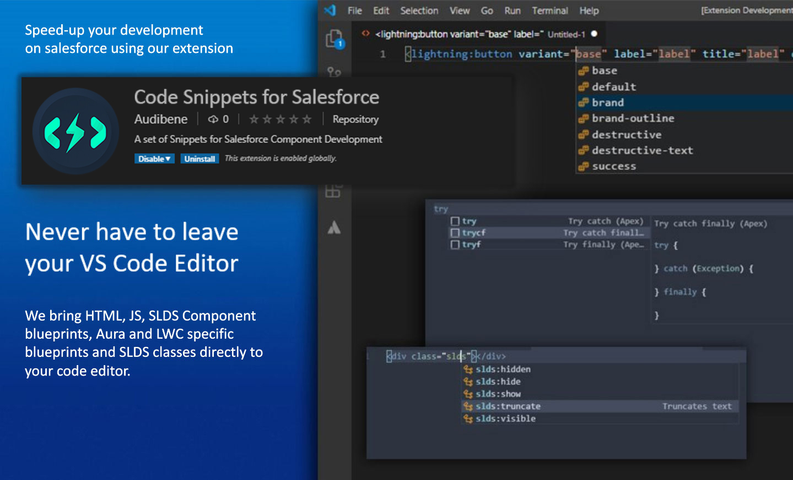

# Salesforce Code Snippets

A set of HTML, JS and Apex Snippets for Visual Studio Code. We bring HTML, JavaScript, SLDS Component Blueprints, Aura and LWC specific Blueprints, and SLDS classes directly to your code editor.

> You can also press `Ctrl + Space` on **Windows** or `Fn + Control + Space` on **Mac** if the snippets are not displayed.

[How it Works](#how-it-works) | [Available Snippets](#available-snippets) | [Advanced Mode](#advanced-mode) | [Installation](#installation) | [Configurations](#configurations) | [Contributors](#contributors)

## How it Works

## Available Snippets

[HTML Snippets](#html-snippets) | [Apex Snippets](#apex-snippets) | [Javascript Snippets](#javascript-snippets) | [Aura Snippets](#aura-snippets) | [Ligntning Web Components Snippets](#ligntning-web-components-snippets) | [SLDS Classes](#slds-classes)

### HTML Snippets
Trigger | Description
--- | ---
bold | Adds Strong tag and moves the cursor between the tags to enter text
grid:1 Column | Adds SLDS grid layout along with single column
grid:2 Columns | Adds SLDS grid layout along with two columns
grid:3 Columns | Adds SLDS grid layout along with three columns
column | Adds Column
Modal Layer | Adds the Audibene Modal Layer HTML along with Controller and Helper function
absolute:center | Adds SLDS layout for absolute center
heading | Adds heading HTML. Supports heading_large, heading_medium, heading_small
text | Adds text HTML - Supports align_left, align_center ,align_right, color_default, color_success,color_weak, color_error, color_inverse, color_inverse-weak
text:left | Text Left
text:center | Text Center
text:right | Text Right
Theme Card: One Column | Use a color theme to apply color to the background and text. Some color themes apply a background image or texture.
Theme Card: Two Columns | Use a color theme to apply color to the background and text. Some color themes apply a background image or texture.
Table:2-columns | Table with 2 columns. Uses automatic column widths based on the content. May overflow from the parent container if it has too many columns.
Table:3-columns | Table with 3 columns. Uses automatic column widths based on the content. May overflow from the parent container if it has too many columns.
Table:fixed-layout 2-columns | Table with 2 columns. Fixed layout makes sure table fits the parent, but all columns have equal width.
Table:fixed-layout 3-columns | Table with 3 columns. Fixed layout makes sure table fits the parent, but all columns have equal width.

### Apex Snippets
Trigger | Description
--- | ---
sysDebug | System Debug
function | New Function
testFunction | New Test Function
tryCatch | Try Catch
getset | Getter Setter
assert | System Assert
assertEqual | System Assert Equal

### Javascript Snippets
Trigger | Description
--- | ---
console.log | Console Log
json:stringify-and-parse | JSON.parse(JSON.stringify(data))
json:parse | JSON.parse(data)
json:stringify | JSON.stringify(data)
evt:dataSet | dataSet
promise | Creates and returns a new Promise in the standard ES6 syntax
thencatch | Add the .then and .catch methods to handle promises
forEach | Adds a forEach Statement
component:set | Adds a component setter Statement
component:get | Adds a component getter Statement
component:find | Adds a component finder Statement
function:controller | Adds a new functions for Controllers
function:helper | Adds a new functions for Helpers
action:Callback | Adds code for callback method
filter | Adds a filter statement
splice | Adds a splice Statement
action:event | Adds code for firing event

### Aura Snippets
Trigger | Description
--- | ---
input:text-aura | Text input fields are for entering single-line text.
input:number-aura | Number input fields support decimal, percentage, and currency values.
input:search-aura | Search input fields enable search queries
input:date-aura | Date input fields provide a date picker for entering a date.
input:time-aura | Time input fields provide a dropdown list of time values
input:datetime-aura | Date/Time input fields provide a date and time picker for entering a date and time.
input:file-aura | File input fields support upload of single or multiple files and can restrict the accepted file types
input:email-aura | Email input fields are for entering email addresses
input:password-aura | Password input fields obscure your text input
input:checkbox-aura | Checkbox options can be required or disabled.
combobox-aura | A combobox enables you to select only one option.
card:basic-aura | Aura Basic Card
icon:aura | Aura Icon
button:basic-aura | Basic Button Aura
button:icon-aura | Basic Button Aura
button:group-aura | Button Group Aura
spinner-aura | Spinner to be displayed in the component body while data is loading
if | Conditionally instantiates and renders either the body.
if empty | Conditionally checks if empty and renders either the body.
if not empty | Conditionally checks if not empty and renders either the body.
if equals | Conditionally checks if equals and renders either the body.
if not equals | Conditionally if not equals and renders either the body.
if else | Conditionally instantiates and renders either the body or the components in the else attribute.
else | Renders else attribute
iteration | Renders a view of a collection of items. Supports iterations containing components that can be created exclusively on the client-side.
attribute | Adds Attributes HTML
hasRecordId | Add the force:hasRecordId interface to a Lightning component to enable the component to be assigned the ID of the current record
appHostable | Add the force:appHostable interface to a Lightning component to allow it to be used as a custom tab in Lightning Experience or the Salesforce mobile app. Attribute name recordId, type String
hasSObjectName | Add the force:hasSObjectName interface to a Lightning component to enable the component to be assigned the API name of current record’s sObject type. Attribute name sObjectName, type String
lightningQuickAction | Add the force:lightningQuickAction interface to a Lightning component to allow it to be used as a custom action in Lightning Experience or the Salesforce mobile app
lightningQuickActionWithoutHeader | Add the force:lightningQuickActionWithoutHeader interface to a Lightning component to allow it to be used as a custom action in Lightning Experience or the Salesforce mobile app
availableForAllPageTypes | To make your component available for record pages and any other type of page, implement the flexipage:availableForAllPageTypes interface
availableForRecordHome | To make your component available for record pages only, implement the flexipage:availableForRecordHome interface.
init | This event is automatically fired when an app or component is initialized, prior to rendering.

### Ligntning Web Components Snippets
Trigger | Description
--- | ---
input:text-lwc | Text input fields are for entering single-line text.
input:number-lwc | Number input fields support decimal, percentage, and currency values.
input:search-lwc | Search input fields enable search queries
input:date-lwc | Date input fields provide a date picker for entering a date.
input:time-lwc | Time input fields provide a dropdown list of time values
input:datetime-lwc | Date/Time input fields provide a date and time picker for entering a date and time.
input:file-lwc | File input fields support upload of single or multiple files and can restrict th
input:email-lwc | Email input fields are for entering email addresses
input:password-lwc | Password input fields obscure your text input
input:checkbox-lwc | Checkbox options can be required or disabled.
combobox-aura | A combobox enables you to select only one option.
card:basic-lwc | LWC Basic Card
icon:lwc | LWC Icon. Supports all Utility icons
button:basic-lwc | Basic Button LWC
button:icon-lwc | Basic Button LWC
spinner-lwc | Spinner to be displayed in the component body while data is loading.

### SLDS Classes 
> These will only work inside the class attributes

Trigger | Description
--- | ---
align_absolute-center | Class will absolutely center children content
border_bottom | Adds a bottom border to an element
border_left | Adds a left border to an element
border_right | Adds a right border to an element
border_top | Adds a top border to an element
box | Provides 1rem base padding and borders
box_alt-inverse | Sets the background color to darker blue
box_error | Sets the background color to red
box_info | Sets the background color to gray-ish blue
box_inverse | Sets the background color to dark blue
box_offline | Sets the background color to black
box_shade | Sets the background color to gray
box_success | Sets the background color to green
box_texture | Adds striped background
box_warning | Sets the background color to yellow
box_x_small | Provides .5rem base padding and borders
box_xx_small | Provides .25rem base padding and borders
float_left | Pulls element from document flow and floats left. Text and other elements wrap around it.
float_none | Removes float from an element that has attribute already
float_right | Pulls element from document flow and floats right. Text and other elements wrap around it.
hidden | Hides an element but reserve the space on the page
hide | Hides an element from the page by setting display propery to none
margin:around_large | Adds 1.5rem margin to all sides
margin:around_medium | Adds 1rem margin to all sides
margin:around_none | Removes margin from all sides
margin:around_small | Adds .75rem margin to all sides
margin:around_x-large | Adds 2rem margin to all sides
margin:around_x-small | Adds .5rem margin to all sides
margin:around_xx-large | Adds 3rem margin to all sides
margin:around_xx-small | Adds .25rem margin to all sides
margin:around_xxx-small | Adds .125rem margin to all sides
margin:bottom_large | Adds 1.5rem margin to bottom
margin:bottom_medium | Adds 1rem margin to bottom
margin:bottom_none | Removes margin from bottom
margin:bottom_small | Adds .75rem margin to bottom
margin:bottom_x-large | Adds 2rem margin to bottom
margin:bottom_x-small | Adds .5rem margin to bottom
margin:bottom_xx-large | Adds 3rem margin to bottom
margin:bottom_xx-small | Adds .25rem margin to bottom
margin:bottom_xxx-small | Adds .125rem margin to bottom
margin:horizontal_large | Adds 1.5rem margin to left and right
margin:horizontal_medium | Adds 1rem margin to left and right
margin:horizontal_none | Removes margin from left and right
margin:horizontal_small | Adds .75rem margin to left and right
margin:horizontal_x-large | Adds 2rem margin to left and right
margin:horizontal_x-small | Adds .5rem margin to left and right
margin:horizontal_xx-large | Adds 3rem margin to left and right
margin:horizontal_xx-small | Adds .25rem margin to left and right
margin:horizontal_xxx-small | Adds .125rem margin to left and right
margin:left_large | Adds 1.5rem margin to left
margin:left_medium | Adds 1rem margin to left
margin:left_none | Removes margin from left
margin:left_small | Adds .75rem margin to left
margin:left_x-large | Adds 2rem margin to left
margin:left_x-small | Adds .5rem margin to left
margin:left_xx-large | Adds 3rem margin to left
margin:left_xx-small | Adds .25rem margin to left
margin:left_xxx-small | Adds .125rem margin to left
margin:right_large | Adds 1.5rem margin to right
margin:right_medium | Adds 1rem margin to right
margin:right_none | Removes margin from right
margin:right_small | Adds .75rem margin to right
margin:right_x-large | Adds 2rem margin to right
margin:right_x-small | Adds .5rem margin to right
margin:right_xx-large | Adds 3rem margin to right
margin:right_xx-small | Adds .25rem margin to right
margin:right_xxx-small | Adds .125rem margin to right
margin:top_large | Adds 1.5rem margin to top
margin:top_medium | Adds 1rem margin to top
margin:top_none | Removes margin from top
margin:top_small | Adds .75rem margin to top
margin:top_x-large | Adds 2rem margin to top
margin:top_x-small | Adds .5rem margin to top
margin:top_xx-large | Adds 3rem margin to top
margin:top_xx-small | Adds .25rem margin to top
margin:top_xxx-small | Adds .125rem margin to top
margin:vertical_large | Adds 1.5rem margin to top and bottom
margin:vertical_medium | Adds 1rem margin to top and bottom
margin:vertical_none | Removes margin from top and bottom
margin:vertical_small | Adds .75rem margin to top and bottom
margin:vertical_x-large | Adds 2rem margin to top and bottom
margin:vertical_x-small | Adds .5rem margin to top and bottom
margin:vertical_xx-large | Adds 3rem margin to top and bottom
margin:vertical_xx-small | Adds .25rem margin to top and bottom
margin:vertical_xxx-small | Adds .125rem margin to top and bottom
padding:around_large | Adds 1.5rem padding to all sides
padding:around_medium | Adds 1rem padding to all sides
padding:around_none | Removes padding from all sides
padding:around_small | Adds .75rem padding to all sides
padding:around_x-large | Adds 2rem padding to all sides
padding:around_x-small | Adds .5rem padding to all sides
padding:around_xx-large | Adds 3rem padding to all sides
padding:around_xx-small | Adds .25rem padding to all sides
padding:around_xxx-small | Adds .125rem padding to all sides
padding:bottom_large | Adds 1.5rem padding to bottom
padding:bottom_medium | Adds 1rem padding to bottom
padding:bottom_none | Removes padding from bottom
padding:bottom_small | Adds .75rem padding to bottom
padding:bottom_x-large | Adds 2rem padding to bottom
padding:bottom_x-small | Adds .5rem padding to bottom
padding:bottom_xx-large | Adds 3rem padding to bottom
padding:bottom_xx-small | Adds .25rem padding to bottom
padding:bottom_xxx-small | Adds .125rem padding to bottom
padding:horizontal_large | Adds 1.5rem padding to left and right
padding:horizontal_medium | Adds 1rem padding to left and right
padding:horizontal_none | Removes padding from left and right
padding:horizontal_small | Adds .75rem padding to left and right
padding:horizontal_x-large | Adds 2rem padding to left and right
padding:horizontal_x-small | Adds .5rem padding to left and right
padding:horizontal_xx-large | Adds 3rem padding to left and right
padding:horizontal_xx-small | Adds .25rem padding to left and right
padding:horizontal_xxx-small | Adds .125rem padding to left and right
padding:left_large | Adds 1.5rem padding to left
padding:left_medium | Adds 1rem padding to left
padding:left_none | Removes padding from left
padding:left_small | Adds .75rem padding to left
padding:left_x-large | Adds 2rem padding to left
padding:left_x-small | Adds .5rem padding to left
padding:left_xx-large | Adds 3rem padding to left
padding:left_xx-small | Adds .25rem padding to left
padding:left_xxx-small | Adds .125rem padding to left
padding:right_large | Adds 1.5rem padding to right
padding:right_medium | Adds 1rem padding to right
padding:right_none | Removes padding from right
padding:right_small | Adds .75rem padding to right
padding:right_x-large | Adds 2rem padding to right
padding:right_x-small | Adds .5rem padding to right
padding:right_xx-large | Adds 3rem padding to right
padding:right_xx-small | Adds .25rem padding to right
padding:right_xxx-small | Adds .125rem padding to right
padding:top_large | Adds 1.5rem padding to top
padding:top_medium | Adds 1rem padding to top
padding:top_none | Removes padding from top
padding:top_small | Adds .75rem padding to top
padding:top_x-large | Adds 2rem padding to top
padding:top_x-small | Adds .5rem padding to top
padding:top_xx-large | Adds 3rem padding to top
padding:top_xx-small | Adds .25rem padding to top
padding:top_xxx-small | Adds .125rem padding to top
padding:vertical_large | Adds 1.5rem padding to top and bottom
padding:vertical_medium | Adds 1rem padding to top and bottom
padding:vertical_none | Removes padding from top and bottom
padding:vertical_small | Adds .75rem padding to top and bottom
padding:vertical_x-large | Adds 2rem padding to top and bottom
padding:vertical_x-small | Adds .5rem padding to top and bottom
padding:vertical_xx-large | Adds 3rem padding to top and bottom
padding:vertical_xx-small | Adds .25rem padding to top and bottom
padding:vertical_xxx-small | Adds .125rem padding to top and bottom
show | Shows the element by setting display property to block
slds-col | Initializes a grid column
slds-grid | Initializes grid
slds-grid_align-center | Columns align in the center to the main axis and expand in each direction
slds-grid_align-end | Columns start on the opposite end of the grid's main axis
slds-grid_align-space | Columns are evenly distributed with equal space around them all
slds-grid_align-spread | Columns align to the left and right followed by center. Space is equal between them
slds-grid_vertical-align-center | Columns align in the center to the cross axis and expand it each direction
slds-grid_vertical-align-end | Columns start on the opposite end of the grid's cross axis
slds-grid_vertical-align-start | Columns start at the beginning of the grid's cross axis
slds-grid_vertical-stretch | Stretch the grid items for both single row and multi-line rows to fill the height of the parent grid container
slds-gutters | Apply 12px gutters to each grid column when you add this class to an `slds-grid` element
slds-hyphenate | The truncation class can be used on an element, or the truncation include can be added to an existing class.
slds-is-absolute | Used to position an element relative to its closest ancestor with relative positioning.
slds-is-collapsed | Hides elements inside a parent
slds-is-expanded | Shows the elements inside the parent
slds-is-fixed | Used to position an element relative to the viewport.
slds-is-relative | Used to contain children if children are absolutely positioned and out of flow. Also used to position element without changing layout.
slds-is-static | Reset positioning back to normal behavior
slds-no-flex | Removes flexbox from grid column
slds-no-space | Sets the column to a min-width of 0
slds-nowrap | Keeps columns on one line. Allows columns to stretch and fill 100% of the parent’s width and height.
slds-text-body_regular | Creates the 13px regular body copy
slds-text-body_small | Creates a more pale-colored 12px copy
slds-text-color_default | Default color of text
slds-text-color_destructive | Color of text for destructive actions
slds-text-color_error | Error color of text
slds-text-color_inverse | Default color of text on inversed background
slds-text-color_inverse-weak | Weak color of text on inversed background
slds-text-color_success | Success color of text
slds-text-color_weak | Weak color of text
slds-text-heading_large | Very large 28px heading
slds-text-heading_medium | Large 20px heading
slds-text-heading_small | Smaller 16px heading
slds-theme_alert-texture | Adds striped background
slds-theme_alt-inverse | Sets the background color to darker blue
slds-theme_default | Sets the background color to white
slds-theme_error | Sets the background color to red
slds-theme_info | Sets the background color to gray-ish blue
slds-theme_inverse | Sets the background color to dark blue
slds-theme_offline | Sets the background color to black
slds-theme_shade | Sets the background color to gray
slds-theme_success | Sets the background color to green
slds-theme_warning | Sets the background color to yellow
slds-wrap | Allows columns to wrap when they exceed 100% of their parent’s width
slds-table | Initializes data table
slds-no-row-hover | Default Table Row Hover
slds-is-selected | Selected Table Row + Hover
slds-cell-wrap | By default, nowrap is applied
slds-cell-buffer_left | Use to add a left padding buffer to cells
slds-cell-buffer_right | Use to add a right padding buffer to cells
slds-table_cell-buffer | Add left and right padding to the first and last cells of a table
slds-table_bordered | Add vertical borders to a table
slds-has-focus | Focus state on a cell
slds-table_bordered | Add vertical borders to a table
slds-table_col-bordered | Add column borders
slds-table_striped | Add alternating strips to rows
slds-table_fixed-layout | Set table to use fixed layout for width and truncation purposes
text-center | Text Center
text-left | Text Left
text-right | Text Right
truncate | Truncates text
visible | Shows an element which was hidden by slds-hidden

## Advanced Mode

### HTML Snippets
Trigger | Description
--- | ---
button:group-dropdown-aura | Button Group Aura Dropdown 
button:group-dropdown-lwc | Button Group Dropdown LWC
card:narrow-aura | Aura Narrow Card
card:narrow-lwc | LWC Narrow Card
grid:centered | Grid centered
grid:gutters | Grid Gutters
grid:right | Grid Right
grid:spaced | Grid evenly spaced
grid:spread | Grid evenly spread
grid:vertical | Grid Vertical
grid:vertical_bottom | Vertical Bottom
grid:vertical_center | Vertical Center
grid:vertical_top | Vertical Top
grid:wrap | Grid Wrap
heading:large | Large Heading
heading:medium | Medium Heading
heading:small | Small Heading
textColor:default | Default Text Color
textColor:green | Green Text Color
textColor:inverse | Inverse Text Color
textColor:inverse-weak | Inverse Weak Text Color
textColor:red | Red Text Color
textColor:weak | Weak Text Color

### SLDS Classes
Trigger | Description
--- | ---
assistive-text | Hides an element yet enables a screen reader to read the element that is hidden
bottom-magnet | Assumes element below is connected
hide_large | Hides content above 1024px screen
hide_medium | Hides content above 768px screen
hide_small | Hides content above 480px screen
hide_x-large | Hides content above 1280px screen
hide_x-small | Hides content above 320px screen
margin-vd:around_large | Adds margin of 1.5rem in Comfy view and 0.75rem in Compact view
margin-vd:around_medium | Adds margin of 1rem in Comfy view and 0.5rem in Compact view
margin-vd:around_small | Adds margin of 0.75rem in Comfy view and 0.25rem in Compact view
margin-vd:around_x-large | Adds margin of 2rem in Comfy view and 1rem in Compact view
margin-vd:around_x-small | Adds margin of 0.5rem in Comfy view and 0.125rem in Compact view
margin-vd:around_xx-large | Adds margin of 3rem in Comfy view and 1.5rem in Compact view
margin-vd:around_xx-small | Adds margin of 0.25rem in Comfy view and 0.125rem in Compact view
margin-vd:around_xxx-small | Adds margin of 0.125rem in Comfy view and 0.125rem in Compact view
margin-vd:bottom_large | Adds margin of 1.5rem in Comfy view and 0.75rem in Compact view
margin-vd:bottom_medium | Adds margin of 1rem in Comfy view and 0.5rem in Compact view
margin-vd:bottom_small | Adds margin of 0.75rem in Comfy view and 0.25rem in Compact view
margin-vd:bottom_x-large | Adds margin of 2rem in Comfy view and 1rem in Compact view
margin-vd:bottom_x-small | Adds margin of 0.5rem in Comfy view and 0.125rem in Compact view
margin-vd:bottom_xx-large | Adds margin of 3rem in Comfy view and 1.5rem in Compact view
margin-vd:bottom_xx-small | Adds margin of 0.25rem in Comfy view and 0.125rem in Compact view
margin-vd:bottom_xxx-small | Adds margin of 0.125rem in Comfy view and 0.125rem in Compact view
margin-vd:left_large | Adds margin of 1.5rem in Comfy view and 0.75rem in Compact view
margin-vd:left_medium | Adds margin of 1rem in Comfy view and 0.5rem in Compact view
margin-vd:left_small | Adds margin of 0.75rem in Comfy view and 0.25rem in Compact view
margin-vd:left_x-large | Adds margin of 2rem in Comfy view and 1rem in Compact view
margin-vd:left_x-small | Adds margin of 0.5rem in Comfy view and 0.125rem in Compact view
margin-vd:left_xx-large | Adds margin of 3rem in Comfy view and 1.5rem in Compact view
margin-vd:left_xx-small | Adds margin of 0.25rem in Comfy view and 0.125rem in Compact view
margin-vd:left_xxx-small | Adds margin of 0.125rem in Comfy view and 0.125rem in Compact view
margin-vd:right_large | Adds margin of 1.5rem in Comfy view and 0.75rem in Compact view
margin-vd:right_medium | Adds margin of 1rem in Comfy view and 0.5rem in Compact view
margin-vd:right_small | Adds margin of 0.75rem in Comfy view and 0.25rem in Compact view
margin-vd:right_x-large | Adds margin of 2rem in Comfy view and 1rem in Compact view
margin-vd:right_x-small | Adds margin of 0.5rem in Comfy view and 0.125rem in Compact view
margin-vd:right_xx-large | Adds margin of 3rem in Comfy view and 1.5rem in Compact view
margin-vd:right_xx-small | Adds margin of 0.25rem in Comfy view and 0.125rem in Compact view
margin-vd:right_xxx-small | Adds margin of 0.125rem in Comfy view and 0.125rem in Compact view
margin-vd:top_large | Adds margin of 1.5rem in Comfy view and 0.75rem in Compact view
margin-vd:top_medium | Adds margin of 1rem in Comfy view and 0.5rem in Compact view
margin-vd:top_small | Adds margin of 0.75rem in Comfy view and 0.25rem in Compact view
margin-vd:top_x-large | Adds margin of 2rem in Comfy view and 1rem in Compact view
margin-vd:top_x-small | Adds margin of 0.5rem in Comfy view and 0.125rem in Compact view
margin-vd:top_xx-large | Adds margin of 3rem in Comfy view and 1.5rem in Compact view
margin-vd:top_xx-small | Adds margin of 0.25rem in Comfy view and 0.125rem in Compact view
margin-vd:top_xxx-small | Adds margin of 0.125rem in Comfy view and 0.125rem in Compact view
padding-vd:around_large | Adds padding of 1.5rem in Comfy view and 0.75rem in Compact view
padding-vd:around_medium | Adds padding of 1rem in Comfy view and 0.5rem in Compact view
padding-vd:around_small | Adds padding of 0.75rem in Comfy view and 0.25rem in Compact view
padding-vd:around_x-large | Adds padding of 2rem in Comfy view and 1rem in Compact view
padding-vd:around_x-small | Adds padding of 0.5rem in Comfy view and 0.125rem in Compact view
padding-vd:around_xx-large | Adds padding of 3rem in Comfy view and 1.5rem in Compact view
padding-vd:around_xx-small | Adds padding of 0.25rem in Comfy view and 0.125rem in Compact view
padding-vd:around_xxx-small | Adds padding of 0.125rem in Comfy view and 0.125rem in Compact view
padding-vd:bottom_large | Adds padding of 1.5rem in Comfy view and 0.75rem in Compact view
padding-vd:bottom_medium | Adds padding of 1rem in Comfy view and 0.5rem in Compact view
padding-vd:bottom_small | Adds padding of 0.75rem in Comfy view and 0.25rem in Compact view
padding-vd:bottom_x-large | Adds padding of 2rem in Comfy view and 1rem in Compact view
padding-vd:bottom_x-small | Adds padding of 0.5rem in Comfy view and 0.125rem in Compact view
padding-vd:bottom_xx-large | Adds padding of 3rem in Comfy view and 1.5rem in Compact view
padding-vd:bottom_xx-small | Adds padding of 0.25rem in Comfy view and 0.125rem in Compact view
padding-vd:bottom_xxx-small | Adds padding of 0.125rem in Comfy view and 0.125rem in Compact view
padding-vd:left_large | Adds padding of 1.5rem in Comfy view and 0.75rem in Compact view
padding-vd:left_medium | Adds padding of 1rem in Comfy view and 0.5rem in Compact view
padding-vd:left_small | Adds padding of 0.75rem in Comfy view and 0.25rem in Compact view
padding-vd:left_x-large | Adds padding of 2rem in Comfy view and 1rem in Compact view
padding-vd:left_x-small | Adds padding of 0.5rem in Comfy view and 0.125rem in Compact view
padding-vd:left_xx-large | Adds padding of 3rem in Comfy view and 1.5rem in Compact view
padding-vd:left_xx-small | Adds padding of 0.25rem in Comfy view and 0.125rem in Compact view
padding-vd:left_xxx-small | Adds padding of 0.125rem in Comfy view and 0.125rem in Compact view
padding-vd:right_large | Adds padding of 1.5rem in Comfy view and 0.75rem in Compact view
padding-vd:right_medium | Adds padding of 1rem in Comfy view and 0.5rem in Compact view
padding-vd:right_small | Adds padding of 0.75rem in Comfy view and 0.25rem in Compact view
padding-vd:right_x-large | Adds padding of 2rem in Comfy view and 1rem in Compact view
padding-vd:right_x-small | Adds padding of 0.5rem in Comfy view and 0.125rem in Compact view
padding-vd:right_xx-large | Adds padding of 3rem in Comfy view and 1.5rem in Compact view
padding-vd:right_xx-small | Adds padding of 0.25rem in Comfy view and 0.125rem in Compact view
padding-vd:right_xxx-small | Adds padding of 0.125rem in Comfy view and 0.125rem in Compact view
padding-vd:top_large | Adds padding of 1.5rem in Comfy view and 0.75rem in Compact view
padding-vd:top_medium | Adds padding of 1rem in Comfy view and 0.5rem in Compact view
padding-vd:top_small | Adds padding of 0.75rem in Comfy view and 0.25rem in Compact view
padding-vd:top_x-large | Adds padding of 2rem in Comfy view and 1rem in Compact view
padding-vd:top_x-small | Adds padding of 0.5rem in Comfy view and 0.125rem in Compact view
padding-vd:top_xx-large | Adds padding of 3rem in Comfy view and 1.5rem in Compact view
padding-vd:top_xx-small | Adds padding of 0.25rem in Comfy view and 0.125rem in Compact view
padding-vd:top_xxx-small | Adds padding of 0.125rem in Comfy view and 0.125rem in Compact view
show_inline | Shows the element by setting display to inline
show_inline-block | Shows the element by setting display to inline-block
show_large | Shows content above 1024px screen, hides for below
show_medium | Shows content above 768px screen, hides for below
show_small | Shows content above 480px screen, hides for below
show_x-large | Shows content above 1280px screen, hides for below
show_x-small | Shows content above 320px screen
slds-col_bump-bottom | Bumps grid item(s) away from the other grid items to sit at the bottom, taking up the remaining white-space of the grid container
slds-col_bump-left | Bumps grid item(s) away from the other grid items to sit to the left, taking up the remaining white-space of the grid container
slds-col_bump-right | Bumps grid item(s) away from the other grid items to sit to the right, taking up the remaining white-space of the grid container
slds-col_bump-top | Bumps grid item(s) away from the other grid items to sit at the top, taking up the remaining white-space of the grid container
slds-container_center | Horizontally positions containers in the center of the viewport
slds-container_fluid | Width of container takes up 100% of viewport
slds-container_large | Restrict width of containers to a maximum of 1024px
slds-container_left | Horizontally positions containers to the left of the viewport
slds-container_medium | Restrict width of containers to a maximum of 768px
slds-container_right | Horizontally positions containers to the right of the viewport
slds-container_small | Restrict width of containers to a maximum of 480px
slds-container_x-large | Restrict width of containers to a maximum of 1280px
slds-dl_horizontal | Causes description list to display horizontally with `dt` consuming 33% of the space and the `dd` taking up the rest.
slds-dl_horizontal__detail | Marks a description
slds-dl_horizontal__label | Marks a term
slds-dl_inline | Causes description list to display horizontally with `dt` followed immediately by the `dd`.
slds-dl_inline__detail | Marks a description
slds-dl_inline__label | Marks a term
slds-grid_frame | Initializes grid
slds-grid_pull-padded | Normalizes the 0.75rem of padding when nesting a grid in a region with `.slds-p-horizontal_small`
slds-grid_pull-padded-large | Normalizes the 1.5rem of padding when nesting a grid in a region with `.slds-p-horizontal_large`
slds-grid_pull-padded-medium | Normalizes the 1rem of padding when nesting a grid in a region with `.slds-p-horizontal_medium`
slds-grid_pull-padded-small | Normalizes the 0.75rem of padding when nesting a grid in a region with `.slds-p-horizontal_small`
slds-grid_pull-padded-x-large | Normalizes the 1.5rem of padding when nesting a grid in a region with `.slds-p-horizontal_x-large`
slds-grid_pull-padded-x-small | Normalizes the 0.5rem of padding when nesting a grid in a region with `.slds-p-horizontal_x-small`
slds-grid_pull-padded-xx-large | Normalizes the 1.5rem of padding when nesting a grid in a region with `.slds-p-horizontal_xx-large`
slds-grid_pull-padded-xx-small | Normalizes the 0.25rem of padding when nesting a grid in a region with `.slds-p-horizontal_xx-small`
slds-grid_pull-padded-xxx-small | Normalizes the 0.125rem of padding when nesting a grid in a region with `.slds-p-horizontal_xxx-small`
slds-grid_reverse | Initializes grid
slds-grid_vertical | Initializes grid
slds-grid_vertical-reverse | Initializes grid
slds-grow | Allows column to grow to children’s content
slds-grow-none | Prevents column from growing to children’s content
slds-gutters_direct | Apply 12px gutters to only direct column children when you add this class to an `slds-grid` element
slds-gutters_direct-large | Apply 24px gutters to only direct column children when you add this class to an `slds-grid` element
slds-gutters_direct-medium | Apply 16px gutters to only direct column children when you add this class to an `slds-grid` element
slds-gutters_direct-small | Apply 12px gutters to only direct column children when you add this class to an `slds-grid` element
slds-gutters_direct-x-large | Apply 32px gutters to only direct column children when you add this class to an `slds-grid` element
slds-gutters_direct-x-small | Apply 8px gutters to only direct column children when you add this class to an `slds-grid` element
slds-gutters_direct-xx-large | Apply 48px gutters to only direct column children when you add this class to an `slds-grid` element
slds-gutters_direct-xx-small | Apply 4px gutters to only direct column children when you add this class to an `slds-grid` element
slds-gutters_direct-xxx-small | Apply 2px gutters to only direct column children when you add this class to an `slds-grid` element
slds-gutters_large | Apply 24px gutters to each grid column when you add this class to an `slds-grid` element
slds-gutters_medium | Apply 16px gutters to each grid column when you add this class to an `slds-grid` element
slds-gutters_small | Apply 12px gutters to each grid column when you add this class to an `slds-grid` element
slds-gutters_x-large | Apply 32px gutters to each grid column when you add this class to an `slds-grid` element
slds-gutters_x-small | Apply 8px gutters to each grid column when you add this class to an `slds-grid` element
slds-gutters_xx-large | Apply 48px gutters to each grid column when you add this class to an `slds-grid` element
slds-gutters_xx-small | Apply 4px gutters to each grid column when you add this class to an `slds-grid` element
slds-gutters_xxx-small | Apply 2px gutters to each grid column when you add this class to an `slds-grid` element
slds-has-flexi-truncate | Needed when truncation is nested in a flexible container in a grid
slds-is-nested | Provides styles for a nested lists
slds-is-visually-empty | Hides element and removes width
slds-item_detail | Label of the name-value pair variant. Layout is modified by its parent class.
slds-item_label | Label of the name-value pair variant. Layout is modified by its parent class.
slds-list_horizontal | Causes items of a list to display horizontally
slds-list_vertical-space | Marks a vertical list with .5rem spacing around
slds-list_vertical-space-medium | Marks a vertical list with 1rem spacing around
slds-media__body | Defines the body area
slds-media__figure | Defines the figure area
slds-media__figure_reverse | Defines the figure area on the other side
slds-media_center | Aligns the content in the .slds-media__body to the middle of the .slds-media__figure
slds-media_inline | Aligns the figure and body to be inline-block of each other
slds-media_large | Adjusts whitespace on larger media objects
slds-media_responsive | .slds-media__figure and .slds-media__body stack on smaller screens
slds-media_small | Adjusts whitespace on smaller media objects
slds-scrollable:auto | Forces element to scroll horizontally and vertically when content exceeds element's width and height
slds-scrollable:none | Forces overflow items to not scroll within element's width and height
slds-scrollable:xAxis | Forces element to scroll vertically when content exceeds element's width
slds-scrollable:yAxis | Forces element to scroll vertically when content exceeds element's height
slds-shrink | Allows column to shrink to children's content
slds-shrink-none | Prevents column from shrinking to children's content
slds-text-font_monospace | Monospace font family
slds-text-link | Used in combination with `.slds-text-link--reset`, you can apply the class `.slds-text-link` to a child element to reset its styles back to that of a link.
slds-text-link_faux | Faux links are used on areas that can't be wrapped in an `a` element, but need to appear to be a link with an underline on hover. An example is in the page header for Object home. The `H1` and `button` that sit next to each other have the `.slds-text-link--faux` class on their parent element.
slds-text-link_reset | Makes links and buttons appear as regular text
slds-text-longform | Adds default spacing and list styling within a wrapper
slds-truncate:25% | Truncates text at 25% of its parent container
slds-truncate:33% | Truncates text at 33% of its parent container
slds-truncate:50% | Truncates text at 50% of its parent container
slds-truncate:66% | Truncates text at 66% of its parent container
slds-truncate:75% | Truncates text at 75% of its parent container
top-magnet | Assumes element above is connected
transition-hide | Hides an element from the page by setting the opacity property set to 0
transition-show | Shows the element using the opacity property set to 1

## Installation
- [Salesforce Code Snippets on Visual Studio Marketplace](https://marketplace.visualstudio.com/items?itemName=Audibene.salesforcecodesnippets)

## Configurations
- [x] Enable Apex snippets 
- [x] Enable Aura Snippets
- [x] Enable JavaScript snippets
- [x] Enable LWC Snippets
- [x] Enable SLDS Classes
- [x] Enable Advanced Mode

## Contributors
- Marcel Hirthe
- Jatin Sharma
- Suraj Raval
- Rohit Bhargava
- Ashutosh Bhardwaj
